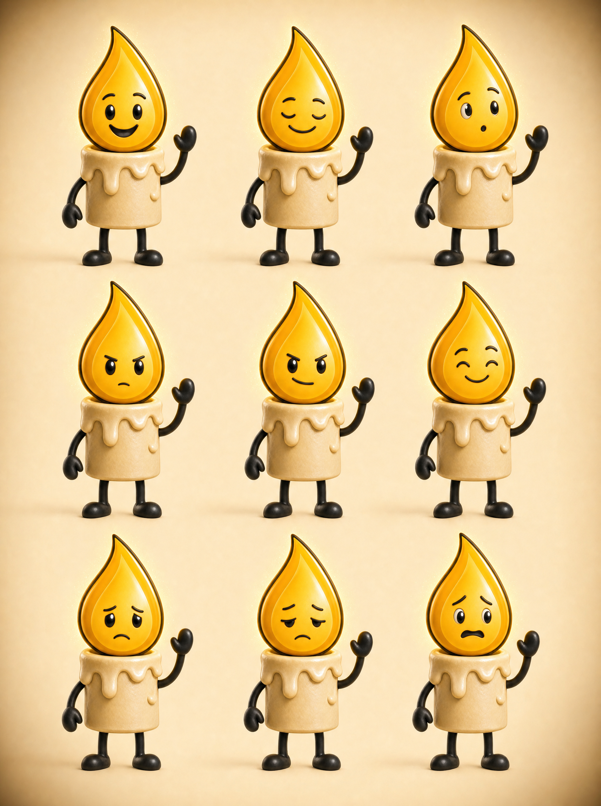

# Wick — Character Reference Sheet



Generated from the locked Higgsfield character element. Use this as the visual
truth for every future generation and for any manual art direction.

## Element (never re-describe Wick in prose)

```
element_id: 5e934732-6de4-438a-b3a6-024144603518
placeholder: <<<5e934732-6de4-438a-b3a6-024144603518>>>
```

Prose descriptions drift; the element does not. Describe only what he is DOING,
WEARING, STANDING IN, and FEELING.

## Locked anatomy

| Part | Spec |
|---|---|
| Head | Large glossy golden teardrop flame, thick clean black outline, lighter golden inner highlight, tip leaning slightly to one side |
| Face | Large glossy black oval eyes with white catchlights, thin expressive black brows, small cartoon mouth. No nose, ears, hair, or visible wick |
| Body | Short cylindrical ivory wax candle, soft rounded melted drips at the upper rim and shoulders |
| Limbs | Thin flexible black rubber-hose arms and legs |
| Extremities | Rounded black mitten hands, simple rounded black shoes |
| Render | Polished cinematic 3D cartoon. Never photorealistic |

## Expression set (the 3x3 grid above)

| | Left | Centre | Right |
|---|---|---|---|
| **Row 1** | happy, warm | calm, serene | curious, interested |
| **Row 2** | focused, absorbed | determined, resolute | quietly proud |
| **Row 3** | sombre, serious | weary, defeated | alarmed, uneasy |

**Expression is required on every scene.** The copy engine emits a per-scene
expression and the prompt builder appends "His expression is ___." A serious
post gets a serious face. Never default to smiling.

Typical mapping:
- Ancient / VERSUS top panel → calm, absorbed, quietly proud, resolute
- Modern / VERSUS bottom panel → hollow, vacant, anxious, defeated, numb
- ORDER command panel → determined, disciplined
- ORDER payoff panel → quietly satisfied, awed
- LESSON problem scenes → troubled, weary, uneasy
- CTA / closing scenes → warm, resolved, quietly hopeful

## Hard rules

- **Wax level never changes.** Identical in every image, forever. First drift a viewer notices.
- **Costuming below the neck only.** Robes and drapes on the wax body, props in mitten hands, headgear resting beside him on the ground. **Nothing ever goes on the flame head** — it is the recognition anchor.
- **The flame is the light source.** In cold-lit scenes cold light may compete, but amber always wins his face. He never reads as a grey blob.
- **He appears in both panels** of any two-panel post. He is the constant; the world changes.

## Generation parameters

```
model:        gpt_image_2
aspect_ratio: 3:2  for VERSUS / ORDER panels
              3:4  for COSTUME / LESSON / CTA slides
              (gpt_image_2 REJECTS 4:5 — the renderer maps 4:5 to 3:4
               automatically and the compositor normalizes to 1080x1350)
quality:      high
resolution:   2k
```
