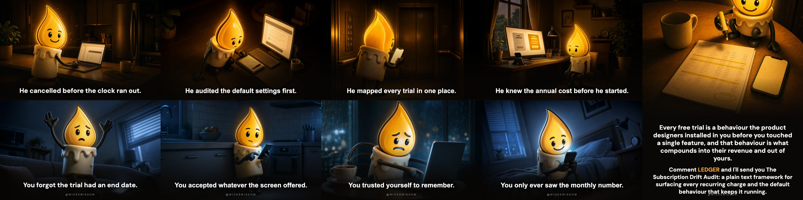
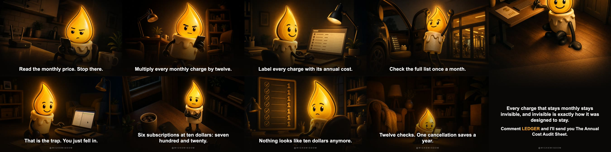
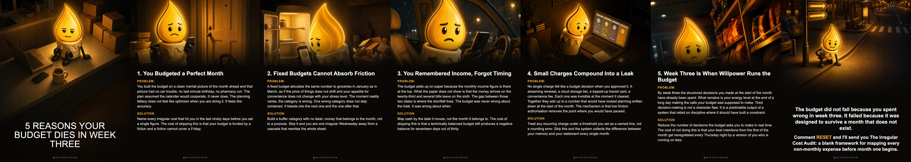

# Wick's Wisdom — Format Examples

One complete carousel per format, generated from the 30 episode registry.
Every slide is exactly 1080x1350 so Instagram will not crop the set.
All label text is composited after generation, never drawn by the image model,
so copy can be corrected without paying to re-roll art.

| Format | Episode | Lane | Slides |
| --- | --- | --- | --- |
| VERSUS | #6 Why Free Trials Work on You Every Time | HYBRID | 5 |
| ORDER | #19 Why Ten Dollars a Month Feels Like Nothing | HYBRID | 5 |
| COSTUME | #30 Where Your Money Goes When You Swipe | MONEY_SYSTEMS | 7 |
| LESSON | #15 Why Your Budget Dies in Week Three | HYBRID | 7 |

---

## VERSUS — Why Free Trials Work on You Every Time

**Episode** #6 · **Lane** HYBRID
**Mechanic** Loss aversion plus defaults · **Lands on** Subscription drift engineering
**Pillar link** Behaviour to Money

> The default behaviour the trial plants inside you is the mechanism that moves money out of your account every month without requiring your attention again.



### Slides

1. **He cancelled before the clock ran out.** / *You forgot the trial had an end date.*
2. **He audited the default settings first.** / *You accepted whatever the screen offered.*
3. **He mapped every trial in one place.** / *You trusted yourself to remember.*
4. **He knew the annual cost before he started.** / *You only ever saw the monthly number.*
5. **CTA:** Every free trial is a behaviour the product designers installed in you before you touched a single feature, and that behaviour is what compounds into their revenue and out of yours. (keyword LEDGER)

### Caption

```
Most people think they just forgot to cancel.

It isn't.

The trial is designed to convert your inaction into a billing relationship.

Default settings stay on.
Monthly numbers hide annual costs.
Memory is the weakest audit system you own.
One place to track trials never gets built.

The hidden rule is this:

The moment you accept a trial, a default behaviour is already running inside you, and that behaviour moves money out of your account every month without ever needing your attention again.

Twelve dollars feels like nothing. Twelve dollars across six forgotten trials is eight hundred and sixty four dollars a year, all of it leaving quietly.

Pay attention before the clock does.

Which subscription in your life right now would you cancel if someone put the annual number in front of you?

Light one. Pass it on. 🕯️
```

---

## ORDER — Why Ten Dollars a Month Feels Like Nothing

**Episode** #19 · **Lane** HYBRID
**Mechanic** Denomination effect · **Lands on** The annual number
**Pillar link** Behaviour to Money

> The brain files small recurring charges as negligible, so the behaviour of ignoring them compounds silently into a money leak the annual number finally makes visible.



### Slides

1. **Read the monthly price. Stop there.** / *That is the trap. You just fell in.*
2. **Multiply every monthly charge by twelve.** / *Six subscriptions at ten dollars: seven hundred and twenty.*
3. **Label every charge with its annual cost.** / *Nothing looks like ten dollars anymore.*
4. **Check the full list once a month.** / *Twelve checks. One cancellation saves a year.*
5. **CTA:** Every charge that stays monthly stays invisible, and invisible is exactly how it was designed to stay. (keyword LEDGER)

### Caption

```
Most people think ten dollars a month is basically nothing.

It adds up.

Your brain files small recurring charges as negligible because the number never changes. The annual number does the damage you never see.

Six charges at ten dollars is seven hundred and twenty a year.
Twelve charges is fourteen forty.
One forgotten trial is one twenty.
None of it felt expensive at the time.

The hidden rule is this:
The brain treats monthly as permanent and small, so the behaviour of ignoring each charge compounds silently until the annual total finally makes the leak visible.

Seven hundred and twenty dollars does not feel like ten dollars. It never did. You just never ran the number.

See it clearly.

When did you last multiply every subscription by twelve and look at the real total?

Light one. Pass it on. 🕯️
```

---

## COSTUME — Where Your Money Goes When You Swipe

**Episode** #30 · **Lane** MONEY_SYSTEMS
**Mechanic** The invisible chain taking a cut · **Lands on** The invisible chain taking a cut
**Pillar link** Systems decide where money flows before the reader ever opens their wallet. Money is the score the system was always keeping.

> Every time you swipe, at least four separate parties have already negotiated their cut before you see the total.


### Slides

1. **The one who built the rails** — Designs and maintains the payment network infrastructure that every transaction must physically travel through, collecting a fraction of every dollar that moves.
2. **The one who issues the card** — Lends the purchasing power, sets the interest rate, and earns interchange on every swipe, turning your spending habit into a recurring revenue stream.
3. **The one who processes the signal** — Sits between the merchant and the issuing bank, authenticating each transaction in milliseconds and billing a per-transaction fee that is invisible to the buyer and non-negotiable for the seller.
4. **The one who takes the terminal fee** — Rents the physical or software point-of-sale device to the merchant, charging a monthly flat rate plus a percentage, so the cost of accepting money costs money.
5. **The one who absorbs the margin** — The merchant who bakes processing costs into the sticker price, meaning the customer buying in cash pays the same amount as the one who triggered the fee.
6. **The one who funds it all** — The buyer at the end of the chain whose swipe sets every upstream fee in motion, paying a price that already contains every cut taken before the purchase was complete.
7. **CTA:** Six parties are in the room every time you swipe. You paid for five of them and only noticed one. (keyword LEDGER)

### Caption

```
Most people think the price they see is what the transaction costs.

It isn't.

That number cleared four separate tollbooths before it reached your screen.

One party built the network the signal travels on.
One party issued the card and owns the relationship with you.
One party processed the transaction in the background.
One party took a cut at the terminal itself.

The hidden rule is this: your spending behaviour generates value for multiple systems simultaneously, and your awareness of that fact is exactly what those systems are not designed to create.

Twelve dollars a month feels like twelve dollars. Twelve dollars moving through four margin-sharing parties, across every cardholder, every day, is a different kind of machine entirely.

Run the numbers on your own monthly card spend. Then ask how much of that you have ever thought about.

Pay attention.

What is one recurring charge you are still not entirely sure what it does?

Light one. Pass it on. 🕯️
```

---

## LESSON — Why Your Budget Dies in Week Three

**Episode** #15 · **Lane** HYBRID
**Mechanic** Planning fallacy · **Lands on** Structural failure of fixed budgets
**Pillar link** Mind distorts the plan; Money absorbs the damage when the distortion meets reality



### Slides

1. **COVER:** 5 REASONS YOUR BUDGET DIES IN WEEK THREE
2. **You Budgeted a Perfect Month** — You built the budget on a clean mental picture of the month ahead and that picture had no car trouble, no last-minute birthday, no pharmacy run. The plan assumed the calendar would cooperate. It never does. The planning fallacy does not feel like optimism when you are doing it. It feels like accuracy.
3. **Fixed Budgets Cannot Absorb Friction** — A fixed budget allocates the same number to groceries in January as in March, as if the price of things does not shift and your appetite for convenience does not change with your stress level. The moment reality varies, the category is wrong. One wrong category does not stay contained. It bleeds into the next one and the one after that.
4. **You Remembered Income, Forgot Timing** — The budget adds up on paper because the monthly income figure is there at the top. What the paper does not show is that the money arrives on the twenty-third and several bills leave on the sixth. The gap between those two dates is where the shortfall lives. The budget was never wrong about the total. It was wrong about when.
5. **Small Charges Compound Into a Leak** — No single charge felt like a budget decision when you approved it. A streaming renewal, a cloud storage tier, a topped-up transit card, a convenience fee. Each one was invisible at the moment it cleared. Together they add up to a number that would have looked alarming written down at the start of the month. The mechanism is that low friction authorisation removes the point where you would have paused.
6. **Week Three Is When Willpower Runs the Budget** — By week three the structured decisions you made at the start of the month have already been spent. What remains is your energy level at the end of a long day making the calls your budget was supposed to make. Tired decision-making is not a character flaw. It is a predictable output of a system that relied on discipline where it should have built a constraint.
6. **CTA:** The budget did not fail because you spent wrong in week three. It failed because it was designed to survive a month that does not exist. (keyword RESET)

### Caption

```
Most people think the budget broke because week three got sloppy.

It didn't.

The budget broke before the month even started.

Your income landed on the 1st. Your rent left on the 3rd.
Your variable weeks have different friction than your plan assumed.
Your subscriptions scattered across dates you stopped tracking.
Your willpower was doing a job the system should have been doing.

The hidden rule is this:
A fixed budget running on mental discipline is a behaviour strategy, and behaviour strategies always lose to a calendar designed to drain you at irregular intervals.

Miss this once and you rebuild the same broken blueprint next month.
Twelve months of that is twelve restarts, and restarts are not progress.

Fix the design.

What day does your budget actually start falling apart, and do you know why?

Light one. Pass it on. 🕯️
```
